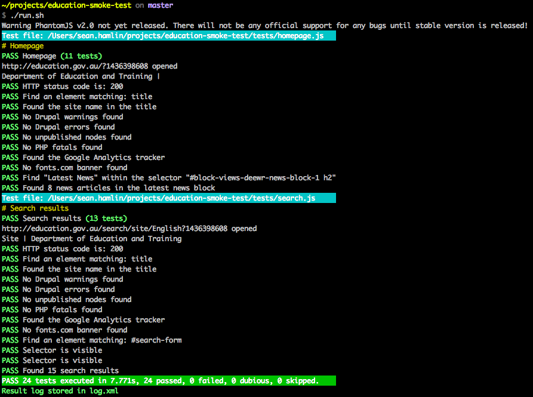

# Education.gov.au smoke tests

General smoke tests for the education.gov.au site. The idea is to reduce manual effort by automating these checks as much as we can.

## Installation

First you will need to install PhantomJS, the [2.1.1 release](http://phantomjs.org/download.html) (or newer) is preferred. Once you have downloaded the binary, symlink this to <code>/usr/local/bin/phantomjs</code>.

Next is CasperJS, you can git clone this repo

```
git clone https://github.com/n1k0/casperjs.git
git checkout 1.1.1
```

Then symlink the bin/casperjs script to <code>/usr/local/bin/casperjs</code>.

You can verify this works by running:

```
casperjs --version
phantomjs --version
```

From anywhere (as these should now be on your path).

## Run the tests

This is simple.

```
./run.sh
```

You can also test the TEST site instance with

```
./run.sh -e=TEST
```

CasperJS will report success or failure at the end of the test run. Tests can take upwards of 1 minute to run (depending on site speed).

## Debug

You can run the script with an optional parameter to get CasperJS debug output.

```
./run.sh -v
```

## Example output


